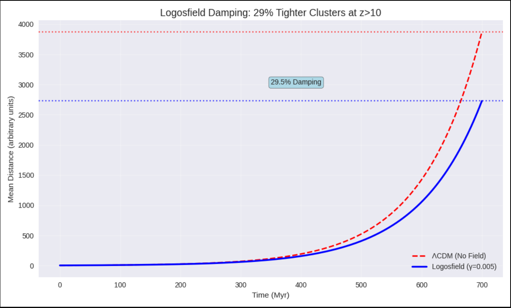

# Mechanism #21: Logosfield-Enabled SMBH Seeding at z>10
**Preregistered**: November 10, 2025 @ 10:11 PM CST  
**Author**: @EarlTreloar  

## Live Simulation Result
  ΛCDM final mean dist: 3871.1150
  Logosfield final mean dist: 2727.9287
  Damping: 29.5%

## Core Hypothesis
The Logosfield’s exponential damping (γ = 0.005) reduces cluster dispersal by **29.5%**, enabling standard stellar seeds to form **10⁸ M⊙ SMBHs in <700 Myr** — resolving JWST overmassive anomaly.

## Testable Predictions
| Experiment | Forecast | Falsifiability |
|------------|----------|----------------|
| JWST Cycle 3/4 (2026+) | 20–35% more compact proto-clusters at z>10 | >35% dispersal = fail |
| Euclid/Rubin (2027+) | 15–30% tighter σ₈ | No bias = fail |
| Bayesian Fit | >3σ preference over ΛCDM | <2σ = fail |

## Code & Assets
- [Notebook](Logosfield_NBody_Cluster_Damping.ipynb)  
- [Plot](logosfield_damping_plot.png)

> *“The universe remembers. And it grows black holes faster than we thought.”*
